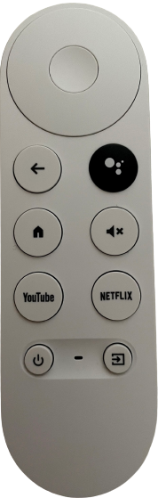

# Remote Control card


```
resources:
  - url: /hacsfiles/generic-remote-control-card/generic-remote-control-card.js
    type: module
```

configuration is very easy. first, find your broadlink id for sending packets (can be found under HA services page),
and then just configure the broadlink codes for each button.

All buttons are configured according to the id of the button in the html section of `remote-html.js`

<details>
  <summary>simple remote example: (Click to expand!)</summary>

```
buttons:
  back:
    call: remote.send_command
    data:
      entity_id: remote.living_room_remote
      command: >-
        b64:JgBgAAABJZEVEBITERMTEhMRExITEhISEjYUNhI3EzYTNhM1ExISNxQQFBETEhE4ExETEhM2EhISNxM2EzYTEhI3EzUUERM2EwAFOgABJ0gSAAwPAAEkSRMADA4AASVJEgANBQAAAAAAAAAA
  bottom:
    call: remote.send_command
    data:
      entity_id: remote.living_room_remote
      command: >-
        b64:JgBQAAABKZIUERMSEhIUERUQFBEUERMSEzYUNhM2FTQUNhM2FBAUNhQ1FTQVNRQRFDUUERUQExITEhQRFBAVNBURFDUVNBU1FAAFTQABKUgVAA0FAAAAAAAAAAA=
  button0:
    call: remote.send_command
    data:
      entity_id: remote.living_room_remote
      command: >-
        b64:JgBQAAABKpITERUQFRAUERQRFBETEhMRFTUUNRU0FTUTNhU0FRAVNRMSFBAVEBQRExIUERQRExEVNBU1FDUVNBU1FDUVNRQ1FAAFTgABKUgWAA0FAAAAAAAAAAA=
  button1:
    call: remote.send_command
    data:
      entity_id: remote.living_room_remote
      command: >-
        b64:JgBQAAABKJIVEBUSEhISEhQRFBEUEBUQFjQUNRU0FDYUNRQ2FBETNhQ1FBEUERQRExETEhUQFBEUERQ1EzYVNRQ1FTQVNRQ1FQAFTQABKUgUAA0FAAAAAAAAAAA=
  button2:
    call: remote.send_command
    data:
      entity_id: remote.living_room_remote
      command: >-
        b64:JgBQAAABKZIWDxQRFBEUERQRExEVEBQSEzYSNxQ2EzYSNxQ2ExEUNRUQFTUUERMRFBEVEBQRFBETNhMSFTQVNRQ1FTUTNhQ1FQAFTQABKUgTAA0FAAAAAAAAAAA=
  button3:
    call: remote.send_command
    data:
      entity_id: remote.living_room_remote
      command: >-
        b64:JgBQAAABKpITERUQFRAUEhMRFBEUERQQFTUUNRQ1FTUUNRU0FRAVNRQ1FTQVERMRExIVEBQQFRAVERQREzYUNRM3EjcTNhQ2EwAFTgABKUgVAA0FAAAAAAAAAAA=
  button4:
    call: remote.send_command
    data:
      entity_id: remote.living_room_remote
      command: >-
        b64:JgBQAAABKZIUERQRFBEUEBUQFRETERQRFDUUNhQ1FTQVNRQ1FBEUNhMRFBEUNRUQExIUERQRFBEUNRM3ExEUNRU1FDUUNRU1FAAFTQABKkcVAA0FAAAAAAAAAAA=
  button5:
    call: remote.send_command
    data:
      entity_id: remote.living_room_remote
      command: >-
        b64:JgBUAAABKZIVEBITFBAVERQRExEUERQREzYUNhM2FDUUNhM2FQ8VNRQ1Fg8UNhQRExEVEBQRFRAUERQ1FBEUNRU1FDUVNBU1FQAFTAABKkcUAAFpCQANBQAAAAA=
  button6:
    call: remote.send_command
    data:
      entity_id: remote.living_room_remote
      command: >-
        b64:JgBQAAABKpITEhMRFBEWDxMRFREVEBMRFDUVNRQ1FTQWNBQ1Fg8WMxYQEzYSNxQRFBEVEBQRExEUNRURFBETNhM2FDYTNhU0FAAFTgABJ0kVAA0FAAAAAAAAAAA=
  button7:
    call: remote.send_command
    data:
      entity_id: remote.living_room_remote
      command: >-
        b64:JgBQAAABJ5MWEBQRFBETERQRFRAUERQRFDUTNhU1FDUVNBU1ExITNhQ2EzUVNRQRFBETEhQRFBAVEBYPFRATNhM2FDYUNRQ1FQAFTgABKEgUAA0FAAAAAAAAAAA=
  button8:
    call: remote.send_command
    data:
      entity_id: remote.living_room_remote
      command: >-
        b64:JgBQAAABJ5MVEBURExEUERQRFQ8VEBUQFDYUNRU0FDYTNhQ2ExEUNRUQFRAVERM2ExEUERUQFBETNhQ1FTUUERQ1FTQVNRU0FQAFTQABKUgTAA0FAAAAAAAAAAA=
  button9:
    call: remote.send_command
    data:
      entity_id: remote.living_room_remote
      command: >-
        b64:JgBQAAABKpIUERQQFRAWDxQRFBEUERQRFDUUNhM1FjQUNRQ1FBEUNhQ1FBEWDxQ2ExITERMSFBAVERM2FDUWDxQ2EjcUNRM3EgAFTwABKkcUAA0FAAAAAAAAAAA=
  buttonClear: null
  buttonEnter: null
  exit:
    call: remote.send_command
    data:
      entity_id: remote.living_room_remote
      command: >-
        b64:JgBYAAABJJMTEhISExEUERMSEhITERQREzYTNhM2EzYTNhM2ExEUNRMSExITNRQ2EjYUERM2ExETNhM3ERMTERMRFDYSEhM2EwAFOwABJ0cSAAwPAAElSBQADQU=
  info:
    call: remote.send_command
    data:
      entity_id: remote.living_room_remote
      command: >-
        b64:JgBQAAABKZMUEBUQExIUERMRFREUERMRFDUVNRQ1FDUVNRQ1FRAVNRQRExEUNRU1FBEUERMSFBAVMxc0FBEUERQ1FTUTNhQ2EwAFTgABKUcVAA0FAAAAAAAAAAA=
  left:
    call: remote.send_command
    data:
      entity_id: remote.living_room_remote
      command: >-
        b64:JgBQAAABKpIVEBMRFRAVEBUQFBEUERQREjcUNhM2EzYUNhM2FBAVNRQ1FRAVEBQ2EzYTERYPFRAVERM2EjcUEBUREzYUNRQ2FAAFTQABKUgUAA0FAAAAAAAAAAA=
  menu:
    call: remote.send_command
    data:
      entity_id: remote.living_room_remote
      command: >-
        b64:JgBQAAABKJMUERQREhMSEhUQFRAUERUQFjMVNBU1FDUUNhQ1FBEUNRQRFBEUNRUQFDYTEhISFBEVNBU1FBETNhQQFTUTNhU0FQAFTgABKEgVAA0FAAAAAAAAAAA=
  mute:
    call: remote.send_command
    data:
      entity_id: remote.living_room_remote
      command: >-
        b64:JgCgAJaSEQ8RDxIPEg8SMBIvEg8SDxIvETERMBAxEg8SDxIPEQ8SkhIPEg8SDxIPETASDxIPERARLxIwEi8SDxIPEjARMBIwERASDREQEjASAAdhlJMSDxEQERARDxIvEjASDxEPETESMBEwEjARDxAQEg8SDxKSEg8REBEPEg8SMBEQEQ8REBIwEi8SLxIPEg8SLxIwEi8SDxEQEg8RMBEADQUAAAAAAAAAAA==
  ok:
    call: remote.send_command
    data:
      entity_id: remote.living_room_remote
      command: >-
        b64:JgBUAAkACXEAASiTFRAUERQRFBETEhQRExEUERU1FDUUNRU1FDUUNRYPEzcTNhQQFjQTEhU0Fg8UERQRFBEVNBQRFDYSEhQ1FTQVNRQABU4AASlIFAANBQAAAAA=
  power:
    call: remote.send_command
    data:
      entity_id: remote.living_room_remote
      command: >-
        b64:JgBQAAABKJIVERQRFBATEhQRFBAUEhQRFDUVNBU1EzYUNRQ2FBETNhQ2ExEUNRU1FBEUERQQFBEVEBU1ExEUERQ1FTUUNRQ1FQAFTQABKUgUAA0FAAAAAAAAAAA=
  right:
    call: remote.send_command
    data:
      entity_id: remote.living_room_remote
      command: >-
        b64:JgBQAAABKZIUERQRExIUERMRFBEVEBQREzYVNBU1FDUUNRU1FBETNhUQFBEUERQ1FTQVERMSExEUNRU1FDUUERUQFDUUNhM2FAAFTgABKEgVAA0FAAAAAAAAAAA=
  source:
    call: remote.send_command
    data:
      entity_id: remote.living_room_remote
      command: >-
        b64:JgBcAAwABPwAASmSFRAVEBQRFBEUERMSFBAUERU1FDUVNBU1FDUVNBUREzYUEBU1ExIUERM2FBAUERUREzYTERQ2FDUTEhQ1FTUUNRQABU0AASpIEwAMVgABKUgUAA0FAAAAAAAAAAAAAAAA
  top:
    call: remote.send_command
    data:
      entity_id: remote.living_room_remote
      command: >-
        b64:JgBQAAABKJIVERQRExIVDxQRFBEUERQREzYTNhU1FTQWMxU1FBETNhQRFDUUNRUQFTUUERMSFBAUNRURExIUNRQQFTUUNRM2FQAFTgABKEgVAA0FAAAAAAAAAAA=
  volmin:
    call: remote.send_command
    data:
      entity_id: remote.living_room_remote
      command: >-
        b64:JgDgAJGUERAREA8RERERLxAyEBEQEBAyDjMRLxMwEBEOEg8RERAOlBMPEBEQEBEQEg8REBAQETIQMBEyEDAQEBIvEjEQMBIPDxIPEhEPETASAAdclJMSDhAREBEPEw8xEi8QERARDzEPMxEwETEQEBEREBASDhGTEg8RDxASEBEOERAQERARMBIwEi8RMhAQETEOMhExEBAREBARDxIPMhEAB1yWkRAQERAQERAREDESLxEREBARMBAxEDERMBEQEREOExAQEZIQERAQEhAQEQ0TEBEQEBExEDEQMBIwERARAA0FAAAAAAAAAAA=
  volplus:
    call: remote.send_command
    data:
      entity_id: remote.living_room_remote
      command: >-
        b64:JgCgAJSSEg8QEBIPERAPMhEyDxERDxAxEDESLxAyEREPEREQEBAQlBARDxIQEBAREi8PMhEvEhAQMRExDzIREBARDhISDhAyEBEQEQ8REi8RAAdclJMRDxAREREPEREwEi8SEBARDzIQMhAwDzESEBARERAQEBKSEg8QEBAREREPMREyDjESDhIwETESLxEQEBEREBAQETAPERERERAQMRAADQUAAAAAAAAAAA==
name: Hisense
remote_template: lg_new
style: |
  ha-card {
    font-size: 10px;
  }
  h1{
    text-align:left;
    margin-left: 50px;
  }
type: 'custom:generic-remote-control-card'


```

</details>

<details>
  <summary>LG remote example: (Click to expand!)</summary>

```
type: 'custom:generic-remote-control-card'
name: LG Tv
remote_template: simple
buttons:
  power:
    call: remote.send_command
    data:
      entity_id: remote.living_room_remote
      command: "b64:JgBYAAABKpIVEBURFDUWEBQRFBETEhURFDUVNRUQFTUVNRQ2FDUTNxQTExEUEhE3ExQTERMSFRITNRU1FDYUEhI3FDUVNRM3FQAFMwABKEoWAAxMAAEqSBUADQU="


  source:
    call: remote.send_command
    data:
      entity_id: remote.living_room_remote
      command: "b64:JgBYAAABJpMSExEUETgRFBEUERMSExITEjcSOBETEjgROBI4ETgSOBETEjgROBITEhMSEhM3ETgTNxITERMSOBE4EjgRExITEQAFGwABJkoSAAxGAAElSxIADQU="


  button1:
  button2:
  button3:
  button4:
  button5:
  button6:
  button7:
  button8:
  button9:
  buttonClear:
  button0:
  buttonEnter:
  exit:
  info:
  menu:
  channeldown:
  channelup:
  netflix:
  left:
    call: remote.send_command
    data:
      entity_id: remote.living_room_remote
      command: "b64:JgBQAAABKpIVEBMRFRAVEBUQFBEUERQREjcUNhM2EzYUNhM2FBAVNRQ1FRAVEBQ2EzYTERYPFRAVERM2EjcUEBUREzYUNRQ2FAAFTQABKUgUAA0FAAAAAAAAAAA="
  right:
    call: remote.send_command
    data:
      entity_id: remote.living_room_remote
      command: "b64:JgBQAAABKZIUERQRExIUERMRFBEVEBQREzYVNBU1FDUUNRU1FBETNhUQFBEUERQ1FTQVERMSExEUNRU1FDUUERUQFDUUNhM2FAAFTgABKEgVAA0FAAAAAAAAAAA="

  top:
  call: remote.send_command
  data:
    entity_id: remote.living_room_remote
    command: "b64:JgBQAAABKJIVERQRExIVDxQRFBEUERQREzYTNhU1FTQWMxU1FBETNhQRFDUUNRUQFTUUERMSFBAUNRURExIUNRQQFTUUNRM2FQAFTgABKEgVAA0FAAAAAAAAAAA="

  bottom:
    call: remote.send_command
    data:
      entity_id: remote.living_room_remote
      command: "b64:JgBQAAABKZIUERMSEhIUERUQFBEUERMSEzYUNhM2FTQUNhM2FBAUNhQ1FTQVNRQRFDUUERUQExITEhQRFBAVNBURFDUVNBU1FAAFTQABKUgVAA0FAAAAAAAAAAA="

  ok:
    call: remote.send_command
    data:
      entity_id: remote.living_room_remote
      command: "b64:JgBUAAkACXEAASiTFRAUERQRFBETEhQRExEUERU1FDUUNRU1FDUUNRYPEzcTNhQQFjQTEhU0Fg8UERQRFBEVNBQRFDYSEhQ1FTQVNRQABU4AASlIFAANBQAAAAA="
  back:
  volplus:
    call: remote.send_command
    data:
      entity_id: remote.living_room_remote
      command: "b64:JgBQAAABJZMTEhITETgSExEUERMSExITETgSOBITETgSNxM3ETgSOBEUETgRFBETEhMSExEUERMTNxISEzcROBM3ETgSOBI3EwAFGQABJkoSAA0FAAAAAAAAAAA="
  volmin:
    call: remote.send_command
    data:
      entity_id: remote.living_room_remote
      command: "b64:JgBYAAABJpMSExEUETgSExEUERMSExEUETgSOBMREjgROBI4ETgSNxI4EjgRExITERQRExITEhMRFBETEjgROBI4ETgSOBE4EQAFGwABJkoSAAxFAAEmShIADQU="

  mute:
    call: remote.send_command
    data:
      entity_id: remote.living_room_remote
      command: "b64:JgCgAJaSEQ8RDxIPEg8SMBIvEg8SDxIvETERMBAxEg8SDxIPEQ8SkhIPEg8SDxIPETASDxIPERARLxIwEi8SDxIPEjARMBIwERASDREQEjASAAdhlJMSDxEQERARDxIvEjASDxEPETESMBEwEjARDxAQEg8SDxKSEg8REBEPEg8SMBEQEQ8REBIwEi8SLxIPEg8SLxIwEi8SDxEQEg8RMBEADQUAAAAAAAAAAA=="

```

</details>

<details>
  <summary>Mibox Remote example, with ADB server: (Click to expand!)</summary>
(remote design by Avi Abeksis)


```
buttons:
  back:
    call: androidtv.adb_command
    data:
      entity_id: media_player.workroom_mibox
      command: input keyevent 4
  bottom:
    call: androidtv.adb_command
    data:
      entity_id: media_player.workroom_mibox
      command: input keyevent 20
  clickleft:
    call: androidtv.adb_command
    data:
      entity_id: media_player.workroom_mibox
      command: input keyevent 21
  clickright:
    call: androidtv.adb_command
    data:
      entity_id: media_player.workroom_mibox
      command: input keyevent 22
  home:
    call: androidtv.adb_command
    data:
      entity_id: media_player.workroom_mibox
      command: input keyevent 3
  ok:
    call: androidtv.adb_command
    data:
      entity_id: media_player.workroom_mibox
      command: input keyevent 66
  power:
    call: androidtv.adb_command
    data:
      entity_id: media_player.workroom_mibox
      command: input keyevent 26
  top:
    call: androidtv.adb_command
    data:
      entity_id: media_player.workroom_mibox
      command: input keyevent 19
  volumedown:
    call: androidtv.adb_command
    data:
      entity_id: media_player.workroom_mibox
      command: input keyevent 25
  volumeup:
    call: androidtv.adb_command
    data:
      entity_id: media_player.workroom_mibox
      command: input keyevent 24
name: Workroom Mibox
remote_template: mibox
type: 'custom:generic-remote-control-card'

```

  </details>

<details>
  <summary>Google Chromecast with Google TV Remote example, with ADB server: (Click to expand!)</summary>
(remote design by @FaserF & @KaiSMR) <br /> 


```
buttons:
  top:
    call: androidtv.adb_command
    data:
      entity_id: media_player.chromecast
      command: input keyevent 19
  bottom:
    call: androidtv.adb_command
    data:
      entity_id: media_player.chromecast
      command: input keyevent 20
  ok:
    call: androidtv.adb_command
    data:
      entity_id: media_player.chromecast
      command: input keyevent 66
  clickleft:
    call: androidtv.adb_command
    data:
      entity_id: media_player.chromecast
      command: input keyevent 21
  clickright:
    call: androidtv.adb_command
    data:
      entity_id: media_player.chromecast
      command: input keyevent 22
  volumedown:
    call: androidtv.adb_command
    data:
      entity_id: media_player.chromecast
      command: input keyevent 25
  volumeup:
    call: androidtv.adb_command
    data:
      entity_id: media_player.chromecast
      command: input keyevent 24
  back:
    call: androidtv.adb_command
    data:
      entity_id: media_player.chromecast
      command: input keyevent 4
  assistant:
    call: androidtv.adb_command
    data:
      entity_id: media_player.chromecast
      command: am start -a android.intent.action.VIEW -d -n com.google.android.apps.tv.launcherx/.home.HomeActivity
  mute:
    call: androidtv.adb_command
    data:
      entity_id: media_player.chromecast
      command: input keyevent 164
  youtube:
    call: androidtv.adb_command
    data:
      entity_id: media_player.chromecast
      #Official YouTube TV
      command: am start -a android.intent.action.VIEW -d -n com.google.android.youtube.tvunplugged/com.google.android.apps.youtube.tvunplugged.activity.MainActivity
      #SmartTubeNext
      #command: am start -a android.intent.action.VIEW -d -n com.liskovsoft.smarttubetv.beta/com.liskovsoft.smartyoutubetv2.tv.ui.browse.BrowseActivity
  netflix:
    call: androidtv.adb_command
    data:
      entity_id: media_player.chromecast
      command: am start -a android.intent.action.VIEW -d -n *com.netflix.ninja/.MainActivity
  home:
    call: androidtv.adb_command
    data:
      entity_id: media_player.chromecast
      command: input keyevent 3
  power:
    call: androidtv.adb_command
    data:
      entity_id: media_player.chromecast
      command: input keyevent 26
  #Source doesnt work yet. We have no clue how to send a input source command via adb
  #source:
  #  call: androidtv.adb_command
  #  data:
  #    entity_id: media_player.chromecast
  #    command: ???
name: Chromecast with Google TV
remote_template: ccwgtv
type: 'custom:generic-remote-control-card'

```

  </details>
  
  
 <details>
  <summary>PartnerTV Remote example, thanx to @VirtualL : (Click to expand!)</summary>


```
type: 'custom:generic-remote-control-card'
name: PartnerTV
remote_template: partner
buttons:
  power:
  volplus:
  volmin:
  partner:
  mute:
  record:
  source:
  one:
  two:
  three:
  four:
  five:
  six:
  seven:
  eight:
  nine:
  zero:
  section12:
  lastch:
  fastforward:
  rewind:
  play:
  stop:
  vod:
  myrec:
  netflix:
  youtube:
  channelup:
  channeldown:
  home:
  back:
  circle:
  left:
  right:
  top:
  bottom:
  ok:
```

  </details>
  
  <details>
  <summary>Samsung TV remote: (Click to expand!)</summary>


```
buttons:
  back:
    call: remote.send_command
    data:
      entity_id: remote.living_room_remote
      command: b64:JgBGAJKWDzsQOhA6EBUPFhAVEBUQFQ87EDoSOBAVEBUPFhITEBUQFREUERQQOhA6EBUQOhAVEDoQOhA6ERQQFRE5EBUPOxEADQUAAA==
  bottom:
    call: remote.send_command
    data:
      entity_id: remote.living_room_remote
      command: b64:JgBEAJCWCEQNPQ09DRkMFw8YDRoKGA09DUEKPQwXDjsPGgoZCz8OIQYUDhgNHAk8DEEMFgscDTwNOw9BCkAJFg8YDTwOAA0FAAAAAA==
  zero:
    call: remote.send_command
    data:
      entity_id: remote.living_room_remote
      command: b64:JgBGAJKVETkRORA7EBQSExEVDxUQFg87DzsTNw8WERQPFhAVDxYPOxAVEBUPFg87DxYRFBAVDxcPOhA6EDoQFRA6ETkQOhAADQUAAA==
  one:
    call: remote.send_command
    data:
      entity_id: remote.living_room_remote
      command: b64:JgBGAJOUETkSOBE5ERQRFBEUEBUQFRE5ETkROREVDxUQFhAWDhYPFhITEDoPFg8VEBYPFg8WEDoQOhAVETkQOhA6EDoQOg8ADQUAAA==
  two:
    call: remote.send_command
    data:
      entity_id: remote.living_room_remote
      command: b64:JgBGAJKVETkRORE5ERQQFREUERQRFBA6EjgTNxAWEBUQFRAVEBUPOxAVEDoPFhAVDxYQFRAVEBUQOhEUEDoQOhA6DzsQOhAADQUAAA==
  three:
    call: remote.send_command
    data:
      entity_id: remote.living_room_remote
      command: b64:JgBGAJKWDzsQOg87EBUQFQ8WEBUQFRA6DzsQOg8WDxYQFRAVDxYQFRA6EDoQFRAVEBURFA8WEDoRFBEUEDoPOxA6EDoPOxAADQUAAA==
  four:
    call: remote.send_command
    data:
      entity_id: remote.living_room_remote
      command: b64:JgBGAJKWEDoSOBA6EBUQFQ8WEBUPFg87EDoQOhAVEBUQExQTEBURFBAVEBUROREUEBURFBEUEDoRORE5EBUSOBE5ETkQOhEADQUAAA==
  five:
    call: remote.send_command
    data:
      entity_id: remote.living_room_remote
      command: b64:JgBGAJKVETkRORE5EBUQFRAVEBUSExE5ETkROREUEBURFBAVEBURORITEBUSOBEUERQQFREUExIQOhE5EBURORE5EjgQOhEADQUAAA==
  six:
    call: remote.send_command
    data:
      entity_id: remote.living_room_remote
      command: b64:JgBGAJKVEDoQOhE5EBURFBEUERQQFRA6ETkQOhEUEBUQFREUERQRFBE5ERQQOhAVEBUQFREUETkRFBE5EhMQOhE5ETkROREADQUAAA==
  seven:
    call: remote.send_command
    data:
      entity_id: remote.living_room_remote
      command: b64:JgBGAJKVETkROhE5DxURFQ8WERQQFRA6EDoQOhEUDxYPFg8WEBUQFREUDzsRORAVEBUQFRAVEDoSOBITERQRORE5EDoTNxEADQUAAA==
  eight:
    call: remote.send_command
    data:
      entity_id: remote.living_room_remote
      command: b64:JgBGAJOUETkRORE5EhMRFBAVEBUQFRA6EzcRORIUDxUQFRAVERQQOhAVEDoQOw8WEBQRFQ8WEBUQORIUEBURORA6EDoQOg8ADQUAAA==
  nine:
    call: remote.send_command
    data:
      entity_id: remote.living_room_remote
      command: b64:JgBGAJKVETkTNxE5ERQRFBEUERQQFRE5EDoROREUERQRFBEUDxYQFRA6ETkRORAVDxYPFhAVDzsRFBAVEBUQOhA6EDoQOg8ADQUAAA==
  exit:
    call: remote.send_command
    data:
      entity_id: remote.living_room_remote
      command: b64:JgCMAJOTEjcTNxI3EhMSEhITEhMRExI3EjcSOBISEhMSExETEhMSNxITEjcSNxITEjcSExETEhMSNxITEhISNxITEjcSOBEABfuTlBI3EjcSOBETEhMSEhITEhMROBI3EjcSExITERMSExISEjgRExI3EjcSExI3EhMSExISEjgRExITEjcSExE4EjcSAA0FAAAAAAAAAAAAAAAA
  info:
    call: remote.send_command
    data:
      entity_id: remote.living_room_remote
      command: b64:JgCMAJSSEjgROBI3EhMRExITEhMRExI3EjgROBISEhMSExETEhMSNxI3EjgROBI3EhMRExITEhMRExITERMSExI3EjcSOBEABfuTlBI3EjcSOBETEhMSExETEhMSNxI3EjcSExITEhISExITETgSNxI3EjcSOBISEhMSExETEhMSExETEhMROBI3EjcSAA0FAAAAAAAAAAAAAAAA
  left:
    call: remote.send_command
    data:
      entity_id: remote.living_room_remote
      command: b64:JgBAAB4FBAgJDgsQDRATnwiKCEEKFwYgDEEJYg2yCBgNGQwfBiAHPQeLCB4LiwoaCRwJQgofB0AKPwgdChsKPwkADQUAAAAAAAAAAA==
  menu:
    call: remote.send_command
    data:
      entity_id: remote.living_room_remote
      command: b64:JgBGAJKVEDoRORE5ERQQFREUERQRFBE5ETkQOhEUERQQFRAVERQRFBA6ERQRORA6ERQQFRAVETkQFRE5EBUQFRA6EDoROREADQUAAA==
  mute:
    call: remote.send_command
    data:
      entity_id: remote.living_room_remote
      command: b64:JgBGAJGWEDoQOhA6EBUQFREUEBURFBA6ETkRORITERQRFBEUEBURORE5ETkROREUERQTEhEUEBYPFhAVEBUQOg87EDoQOg8ADQUAAA==
  ok:
    call: remote.send_command
    data:
      entity_id: remote.living_room_remote
      command: b64:JgBGAJGXDzwMPQ49DhUQFg8WDxYQFBE6ETkPOhAWEBUPFg8WDxYQFQ8WEBYOOhAWDzsSOA8WDzsQOxA4ERUPOxAVDxYQOg8ADQUAAA==
  power:
    call: remote.send_command
    data:
      entity_id: remote.living_room_remote
      command: b64:JgBGAJKVDzsQOhA6EBUQFRAVERQRFBE5EDoSOBEUERQRFBAVEBURFBE5ERQRFBAVERQRFBEUETkRFBE5ETkRORE5EToQOg8ADQUAAA==
  right:
    call: remote.send_command
    data:
      entity_id: remote.living_room_remote
      command: b64:JgBGAI2YEDsMPw47DhgOFQ8YDhcNFw47DzsPPBEVDRcOFhAVEBcPFBE5EBYMGQ8WDjwOPQ0XDzsOFhE7DTwPOw4WDxYPOxAADQUAAA==
  source:
    call: remote.send_command
    data:
      entity_id: remote.living_room_remote
      command: b64:JgBGAJOUEjgSOBI4EhMSExITEhMSExI4EjgSOBITEhMSExITEhMSOBITEhMSExITEhMSExITEhMSOBI4EjgSOBI4EjgSOBIADQUAAA==
  top:
    call: remote.send_command
    data:
      entity_id: remote.living_room_remote
      command: b64:JgBGAJGWEDwNOw88DxQQFg8WDxYPFg86ETkROw8VEBYPFQ8XEBUOFhEVDhYPFhEVDzoROBEVDzsQOw86EDkROhAWDhYPPA4ADQUAAA==
  volmin:
    call: remote.send_command
    data:
      entity_id: remote.living_room_remote
      command: b64:JgBGAJKVEDoSOBE5EBUQFREUERQRFBA6EDoROREUEBURFBEUEBUQOhE5ERQROREUEBURFBAVEBUQFRE5ERQQOhE5EDoQOhAADQUAAA==
  volplus:
    call: remote.send_command
    data:
      entity_id: remote.living_room_remote
      command: b64:JgBGAJKVETkRORA6ERQRFBAVEBUQFRA7EDkROhAUERUQFRAUEBYQOhA6EDoPFhAVEBUQFQ8WEBUPFhAVEDoQOhA6EDoQOg8ADQUAAA==
  channelup:
    call: remote.send_command
    data:
      entity_id: remote.living_room_remote
      command: b64:JgBGAJKVEDkROhE4EBUQFg4XDBkPFw86DzsQOg8WERQPFhAVEBUQFRA5ERUPFhA6DxYQFQ8WDzoRFQ87EDoRFBA5EToQOg8ADQUAAA==
  channeldown:
    call: remote.send_command
    data:
      entity_id: remote.living_room_remote
      command: b64:JgBGAJKVEDoQOhA6ERQQFg8WDxYQFQ87EDoQOg8WDxcOFw8VDxcOFg8XDhYRFQ47EBUPFg8WDzsPPA87EDkRFBE5EjgQOhAADQUAAA==
  guide:
    call: remote.send_command
    data:
      entity_id: remote.living_room_remote
      command: b64:JgCMAJSTEjcSNxI4EhISExITEhISExI3EjcSNxMSEhMSEhITEhMSNxI3EjcSNxMSEhMSNxITEhISExITEhISNxI3ExISNxIABfuTlBI3EjcSNxITEhMSEhITEhMROBI3EjcSExITERMSExISEjgROBI3EjcSExITETgSEhITEhMRExITEjcSNxITEjcSAA0FAAAAAAAAAAAAAAAA
  fastforward:
    call: remote.send_command
    data:
      entity_id: remote.living_room_remote
      command: b64:JgBGAJSVDzsQOhA6EBURFA8WERQSExA6EjgQOhAVEBUQFREUEBUQFREUEBUROREUEhMQOhAVEDoRORE5ERQRORE5EhMSOBEADQUAAA==
  rewind:
    call: remote.send_command
    data:
      entity_id: remote.living_room_remote
      command: b64:JgBGAJOUDzsPOxA6EBURFBAVEBYOFg87EDoQOhEUDxYPFg8WDxYQOhAVDzsQFQ8WEhMQOhAVEBURORAVETkRORE5ERQQOhEADQUAAA==
  play:
    call: remote.send_command
    data:
      entity_id: remote.living_room_remote
      command: b64:JgBGAJOUETkRORA7EBUQFRAVEBUQFQ87DzsPOw8WEBUQFRAVEBUPOxA6EDoRFBEUEBURORAVEBURFBEUEDoRORE5ERUPOw8ADQUAAA==
  pause:
    call: remote.send_command
    data:
      entity_id: remote.living_room_remote
      command: b64:JgBGAJKVETkQOhA6EhMQFREUERQQFRA7DzsQOhAVEBUPFhAVDxYQFRE5EBUQOhAVERQROREUETkQFRE5ERQQOhA6EBUQOhAADQUAAA==
  lastch:
    call: remote.send_command
    data:
      entity_id: remote.living_room_remote
      command: b64:JgCMAJSTEzYTNhM3EhITEhMSEhITEhI3EzYTNhMSExISEhMSExISNxI3ExISEhI3EhMSExISEhMSExI3EjcSExE4EjcSNxIABfuUkhM3EjcTNhMSEhITEhMSEhITNhM3EjcTEhISExISEhMSEzYTNhMSExISNxMRExITEhISExITNhM2ExITNhM2EzcSAA0FAAAAAAAAAAAAAAAA
name: Samsung
remote_template: samsungtv
style: |
  ha-card {
    font-size: 10px;
  }
  h1{
    text-align:left;
    margin-left: 50px;
  }
type: 'custom:generic-remote-control-card'

```

  </details>

  <details>
  <summary>JBL SoundBar 350 Remote (Design and codes by Roger 4R): (Click to expand!)</summary>

   

```

type: custom:generic-remote-control-card
buttons:
  power:
    call: remote.send_command
    data:
      entity_id: remote.broadlink_remote
      command: >-
        b64:JgBQAAABJpISFBITEjgSExMTEhMSFBM3ExISFBI4EhMTOBI4EjgSExI5EjgSOBI4EjgSOBM4EzcTEhMTEhMSExQSEhMSFBITEgAFbAABKEoTAA0F
  bluetooth:
    call: remote.send_command
    data:
      entity_id: remote.broadlink_remote
      command: >-
        b64:JgBMABMSExMSExIUEhMTEhMTEjgSExIUEhMSExI5EjgTNxITEhQTNxITEjgSORI4ExISOBI4ExMTNxMSEhQSExI4ExMTAAW0AAEmSxIADQU=
  source:
    call: remote.send_command
    data:
      entity_id: remote.broadlink_remote
      command: >-
        b64:JgBUAAABJ5ITEhITExMSExIUEhMTEhM3EhQSExIUEhMTNxI4EjgTExITEzcSOBIUEhMSOBITEzgTNxMSEhMTNxM4EhMSOBIUEgAD7ggAAb4AASdKEwANBQ==
  aux:
    call: remote.send_command
    data:
      entity_id: remote.broadlink_remote
      command: >-
        b64:JgBQAAABJpMSExMSExMSExMTExITExM3ExITExITExMSOBM3EzgSExIUEhMTNxMTEjgSOBMTEjgSORM3EhMTOBMSEhQSOBIUEwAFtgABJ0sSAA0F
  optical:
    call: remote.send_command
    data:
      entity_id: remote.broadlink_remote
      command: >-
        b64:JgBQAAABJpMSFBITFBISExMTEhQSExM3EhQSExQSEhMTOBI4EjYVExI5EhMSFBI4EjkSOBI5EjgSFBI4EjkSExIUEhMSFBITEgAFuQABKkoTAA0F
  feedback:
    call: remote.send_command
    data:
      entity_id: remote.broadlink_remote
      command: >-
        b64:JgBQAAABJ5MTExITEhQSExIUExITEhM4ExITExITEhQSOBI4EzgTEhIUEzcTExQ2ExMSOBI4EjkSOBITEzgSExI5EhMSFBITEgAFuQABKUoSAA0F
  minus:
    call: remote.send_command
    data:
      entity_id: remote.broadlink_remote
      command: >-
        b64:JgBQAAABJZMSExMTEhMSExMTEhMTExM3ExISFBITEhMSOBM4EzcTEhMTExITExI4EhMTEhI5EjgSOBI4EjgTExI4EjgUERMTEgAFtQABJ0oTAA0F
  mute:
    call: remote.send_command
    data:
      entity_id: remote.broadlink_remote
      command: >-
        b64:JgBQAAABJpMTEhMTEhMSFBMSEhMTExI4EhMTExQREhQTNxI4EzcSFBM3EhQTEhMSEhQSExI4EzgSExM3EzgTNxI4EjgSFBITEgAFtwABJ0sSAA0F
  plus:
    call: remote.send_command
    data:
      entity_id: remote.broadlink_remote
      command: >-
        b64:JgBQAAABJ5ITEhMTEhMTExITExMSExM4ExISFBITEhQSOBI4EzgTEhI5EzcSOBMTExITExI4EjkSExIUEhMSOBQ3EjgTExITEgAFuQABJ0sUAA0F
  bassminus:
    call: remote.send_command
    data:
      entity_id: remote.broadlink_remote
      command: >-
        b64:JgBQAAABJZMTExMSEhQTEhITEhQSExI4ExMSExITExMSOBM3EjgTEhI5ExITNxI4EhQSOBI4EjgTEhI4EhQSExM3EhQTEhITEwAFtAABJ0kUAA0F
  bassplus:
    call: remote.send_command
    data:
      entity_id: remote.broadlink_remote
      command: >-
        b64:JgBUAAABKJIVERITEhQSExITEhQSExI4ExMSExMTEhMTNxI4EzgSExITExMUNhM3EhQTNxM3EjgTNxM4ExITEhM4ExISFBITEgAFtQABJ0sSAAL6CQANBQ==
  surround:
    call: remote.send_command
    data:
      entity_id: remote.broadlink_remote
      command: >-
        b64:JgBQAAABKJESFBITEhQSExITExMSExI4ExMSExMSEhQSOBI1FjcTEhMTEzcTNxI4ExMSOBMSEjgTNxMTExISFBM3EhMSOBIUEgAFtQABJksSAA0F
  stereo:
    call: remote.send_command
    data:
      entity_id: remote.broadlink_remote
      command: >-
        b64:JgBQAAABJZMTEhM3ExMSExIUExISExI4ExMTNxMSEhQSOBI4EjgTEhIUExISFBI4ExITNxIUEzcSOBM3EjgTExI4EhMTNxIUEgAFawABJ0oTAA0F
  harman:
    call: remote.send_command
    data:
      entity_id: remote.broadlink_remote
      command: >-
        b64:JgBUAAUACQ8AASeSExMSExIUExITExITExITNxIUEhMTExITEzcTNxI4ExMTNxI4EjgTOBITEjgTExM3EhMTExITExITNxMTEjgSFBIABbUAAShKEgANBQ==
name: Jbl
remote_template: jblsoundbar
style: |
  ha-card {
    font-size: 10px;
  }
  h1{
    text-align:left;
    margin-left: 50px;
  }

```

  </details>

  <details>
  <summary>Yes Remote (Design and codes by Rubinov lior): (Click to expand!)</summary>


```
type: 'custom:generic-remote-control-card'
name: 'YES'
remote_template: yesremote
buttons:
  tvpower: null
  yespower:
    call: remote.send_command
    data:
      entity_id: remote.living_room_remote
      command: >-
        b64:JgBYAAABJ5ISExISEjgSEhMSEhMRExM3EhISExI3EjgSNxM3ERMSExI3EhMSExETEhMSNxMSEhMRExI4EjcSOBI3EhMSNxI3EwAFYgABJUoTAAxCAAEmShIADQU=
  amppower:
    call: remote.send_command
    data:
      entity_id: remote.living_room_remote
      command: >-
        b64:JgBUAE4UJxQTFCcUExQnFBMUExQTFBMUExQTFCcAAzxNFCcUExQnFBMUJxQTFBMUExQUFBMUExQnAAM7ThQmFBQTJxQTFCcUExQTFBQTFBQTFBMUJwANBQAAAAA=
  av:
    call: remote.send_command
    data:
      entity_id: remote.living_room_remote
      command: >-
        b64:JgBwAE4UJxQTFCcUExQTFCcUExQnFBMUExQTFBMAA0xOFCcUExQnFBMUExQnFBMUJxQTFBMUExQTAANMThQnFBMUJxQTFBMUJxQTFCYUFBQTFBMUEwADTE4UJxMUFCYUFBQTFCYUFBQmFBMUFBQTFBMADQUAAAAAAAAAAA==
  button1:
    call: remote.send_command
    data:
      entity_id: remote.living_room_remote
      command: >-
        b64:JgBQAAABJ5ISEhITEjgRExITERQRExI4EhISExI3EjgSNxM3EhITEhEUEhISExEUETgSNxMSEhMSNxI3EzcSNxMSERQROBI3EwAFYgABJUoTAA0FAAAAAAAAAAA=
  button2:
    call: remote.send_command
    data:
      entity_id: remote.living_room_remote
      command: >-
        b64:JgBQAAABJpMTEhISEjgSEhITEhMRExM3EhISExI3EzcSNxM3EhISExI3EhMSExE4EhMROBITERQRExI4EjcSExI3EhMSNxM3EgAFYgABJUoTAA0FAAAAAAAAAAA=
  button3:
    call: remote.send_command
    data:
      entity_id: remote.living_room_remote
      command: >-
        b64:JgBQAAABJZMSExETEjgRExITEhMSEhM3EhMRExM3EjcSNxM3EhITEhI3EhMSExE4EzcROBITEhISExI3EzcRFBISEhMROBM3EgAFYgABJUsRAA0FAAAAAAAAAAA=
  button4:
    call: remote.send_command
    data:
      entity_id: remote.living_room_remote
      command: >-
        b64:JgBQAAABJZQSEhITETgSExITERMSExI3EhMSExE4EzcSNxI3ExISExETEhMSExE4EhMROBITERMSOBI3EzcRExI4ERMSOBI3EgAFYgABJkoSAA0FAAAAAAAAAAA=
  button5:
    call: remote.send_command
    data:
      entity_id: remote.living_room_remote
      command: >-
        b64:JgBQAAABJpMSEhMSEjcSExMSERMSExI4EhISExE4EzcSNxI4EhISExETEhMSExETEhMSOBISEhMROBI4ETgSNxM3EhMROBI3EgAFYwABJkkTAA0FAAAAAAAAAAA=
  button6:
    call: remote.send_command
    data:
      entity_id: remote.living_room_remote
      command: >-
        b64:JgBQAAABJZMTEhITETgSExETEhMSExE4ExISEhI4EjcTNxE4EhMSEhITEhMRExI4EjcSOBETExISNxI4EjcTEhETEhMSNxM3EgAFYgABJkoRAA0FAAAAAAAAAAA=
  button7:
    call: remote.send_command
    data:
      entity_id: remote.living_room_remote
      command: >-
        b64:JgBQAAABJZMSExETEzcSEhITEhMRExI4EhMRExI4ETgSNxM3EhITEhITETgSExEUETgSNxMSEhMROBITETgTNhMSEhMSNxM3EgAFYgABJUsSAA0FAAAAAAAAAAA=
  button8:
    call: remote.send_command
    data:
      entity_id: remote.living_room_remote
      command: >-
        b64:JgBQAAABJZMTEhITETgTEhISEhMSExE4EhMRFBE4EjcTNxI3EhMSEhITEzcSEhM3EhISOBISEhMSNxMSEjcTEhI4EhISOBI3EgAFYgABJkoSAA0FAAAAAAAAAAA=
  button9:
    call: remote.send_command
    data:
      entity_id: remote.living_room_remote
      command: >-
        b64:JgBQAAABJpMSEhMSEjcTEhITERQSEhM3EhISExI3EzcROBM2ExISExETEzcSExETExISNxMSEhMSNxITETgTNhM3EhMROBI3EwAFYgABJUoTAA0FAAAAAAAAAAA=
  button0:
    call: remote.send_command
    data:
      entity_id: remote.living_room_remote
      command: >-
        b64:JgBQAAABJZMTEhEUETgSExETEhMSExE4EhMRExM3ETgSOBI3EhMRExI4ETgTEhETEjgROBITEhMSEhITEjcTNxETEhMSNxM3EQAFYwABJkoSAA0FAAAAAAAAAAA=
  vod:
    call: remote.send_command
    data:
      entity_id: remote.living_room_remote
      command: >-
        b64:JgBQAAABJpMSEhMSEjcTEhITEhITEhI3EhMSExI3EjgSNxI3ExISExI3EhMSEhMSEhMSEhMSEhMSEhI4EjcSOBE4EzYSOBI3EwAFYQABJ0kTAA0FAAAAAAAAAAA=
  mytv:
    call: remote.send_command
    data:
      entity_id: remote.living_room_remote
      command: >-
        b64:JgBQAAABJZQRExITETgSExEUERMSExE4EhMSExE4EjgTNhE4EhMSExETEjgSEhITEhMRExI4ERQROBEUEjcSNxI4ETgSExE4FAAFYAABJkoSAA0FAAAAAAAAAAA=
  volumeup: null
  volumedown: null
  channelup:
    call: remote.send_command
    data:
      entity_id: remote.living_room_remote
      command: >-
        b64:JgBYAAABJpITEhITETgSExITERMSExI3EhMSExE4EjcTNxE4EhMSExE4EhMROBITEjcSOBISExISExE4EhMROBITERMSOBE4EwAFYQABJkoSAAxDAAEmSRMADQU=
  channeldown:
    call: remote.send_command
    data:
      entity_id: remote.living_room_remote
      command: >-
        b64:JgBYAAABKJESExMREjgRExQREhMTERI4ExESExM2EjgSNxI4EhISExI3EjgROBITETgSOBETEhMSExETExISNxITEhMROBM3EgAFYgABJUoTAAxCAAElSxEADQU=
  mute:
    call: remote.send_command
    data:
      entity_id: remote.living_room_remote
      command: >-
        b64:JgCoAE4UExQUFCYUExQnFBQTExUmFBMUFRIUFBUAA11OFBQTFhImFBQTKRIUExQUJhQTFBQUExQTAANfThQTFBMUJxQTFCcUExQTFCcUExQTFBQUEwADX04UExQTFCcUExQnFBMUExQnFBMUExQTFBQAA19OFBMUExQnFBMUJxQTFBMUJxQTFBQTExQTAANgThQTFBMUJxQUEycUExQTFCcUExQTFBMUEwANBQ==
  return:
    call: remote.send_command
    data:
      entity_id: remote.living_room_remote
      command: >-
        b64:JgBYAAABJZMTEhEUETgSExETExISExE4EhMRExI4EjcSOBI3EhMRExITEjcSExI3EjgSNxITEhMROBITETgSExETEhMSNxI4EQAFYwABJUsSAAxCAAEmShIADQU=
  clickleft:
    call: remote.send_command
    data:
      entity_id: remote.living_room_remote
      command: >-
        b64:JgBQAAABJpITEhITETgSExITEhISExE4ExISExE4EjcSOBE4ExISExEUERMSNxITEjcSOBISEhMSOBE4ERQROBITERMTNxI3EgAFYgABJ0kSAA0FAAAAAAAAAAA=
  clickright:
    call: remote.send_command
    data:
      entity_id: remote.living_room_remote
      command: >-
        b64:JgBQAAABJpMSEhMSEjcSExITERQRExI4ERMSExE4EjgROBI4ERMSExE4EjgSEhI4ETgTNxISEhMSExETEjgSEhITEhMROBI4EgAFYQABJkoSAA0FAAAAAAAAAAA=
  clickup:
    call: remote.send_command
    data:
      entity_id: remote.living_room_remote
      command: >-
        b64:JgBQAAABJZMTEhEUETgSExETEhMSExE4ExIRExI4ETgSOBE4EhMRExI4EjcTEhE4ExIROBMSEhMRExITETgTEhI3ExISOBE4EgAFYgABJkoSAA0FAAAAAAAAAAA=
  clickdown:
    call: remote.send_command
    data:
      entity_id: remote.living_room_remote
      command: >-
        b64:JgBYAAABJpMRExITEjcSExITERMSExI4ERMSExI3EjgROBI3EhMTEhETExISOBETEhMROBITEhMROBI3ExITNhI4EhMROBI3EgAFYwABJUoTAAxCAAElSxIADQU=
  plus:
    call: remote.send_command
    data:
      entity_id: remote.living_room_remote
      command: >-
        b64:JgBQAAABKJMSEhITEjcTEhMSEhMRExI4ERMSExI3EzcSNxI4ERMTEhEUEhISOBI3EjcSOBEUERMSOBE4EhMRExITEhMROBI3EgAFYwABJUoSAA0FAAAAAAAAAAA=
  info:
    call: remote.send_command
    data:
      entity_id: remote.living_room_remote
      command: >-
        b64:JgBYAAABJZMSExEUETgSExETEhMSExE4EhMRExM3ETgSOBE4EhMRExITEhMSNxI4ERMSOBETEhMROBM3ERMSExI3EhMSOBE4EgAFYgABJkoSAAxDAAElShIADQU=
  ok:
    call: remote.send_command
    data:
      entity_id: remote.living_room_remote
      command: >-
        b64:JgBQAAABJpITEhITETgSExETEhMSExE4EhMRExI4ETgSOBE4EhMRExI4ETgSExEUERMSOBETEhMRFBETEjgROBI3EhMSOBE4EQAFYwABJkoSAA0FAAAAAAAAAAA=
  table:
    call: remote.send_command
    data:
      entity_id: remote.living_room_remote
      command: >-
        b64:JgBQAAABJpMSEhITEjcSExEUERMTEhI3EhMSExE4EjgSNxI3EhMSExETEjgROBITETgTNxETEhMSNxITEhMSNxITERQROBE4EgAFYwABJUoTAA0FAAAAAAAAAAA=
  schedule:
    call: remote.send_command
    data:
      entity_id: remote.living_room_remote
      command: >-
        b64:JgBYAAABJpMRExITETgSExITERMSExI3ExISExI3EjgSNxI3EhMSExETEjgSNxI4ERMSOBETEhMSNxITEhMRExM3ERMSOBE4EgAFYwABJUoTAAxCAAElSxEADQU=
  orange:
    call: remote.send_command
    data:
      entity_id: remote.living_room_remote
      command: >-
        b64:JgBQAAABJZQSEhMSEjcSExITEhISExM2EhMTEhE4EjgSNxE4EhMSExETEjgROBM3ETgSNxMSEhMROBMSERQRExITEhISOBI3EwAFYAABJ0oSAA0FAAAAAAAAAAA=
  green:
    call: remote.send_command
    data:
      entity_id: remote.living_room_remote
      command: >-
        b64:JgBQAAABJpISExETEzcRExITEhMRExI4EhISExI4EjcSNxM3ERMSExI4ERMSOBE4EhMROBITERMSExI3EhMSExE4EhMROBM3EQAFYwABJUsRAA0FAAAAAAAAAAA=
  yellow:
    call: remote.send_command
    data:
      entity_id: remote.living_room_remote
      command: >-
        b64:JgBQAAABJpITEhITETgSExETEhMSExE4EhMRExI4EjcSOBI3EhMRExI4ERQSNxE4EzcSNxITERMSExI4ERMSExITERMTNxE4EgAFYgABJkoSAA0FAAAAAAAAAAA=
  blue:
    call: remote.send_command
    data:
      entity_id: remote.living_room_remote
      command: >-
        b64:JgBQAAABJZQRExITETgSExITERMTEhM2EhMSExI3EjgROBI3ExISExE4EjgSNxI4EjcSNxMSERQRExITEhMSEhITERQSNxE4EgAFYwABJUoSAA0FAAAAAAAAAAA=
  rewind:
    call: remote.send_command
    data:
      entity_id: remote.living_room_remote
      command: >-
        b64:JgBQAAABJpMRFBETEzcRExMSEhMRExI4EhITEhI3EjgSNxM3EhISExITERMSExI3ExISExE4EhMSNxI4ETgWDxI3EjcTEhI4EQAFYwABJkoRAA0FAAAAAAAAAAA=
  play:
    call: remote.send_command
    data:
      entity_id: remote.living_room_remote
      command: >-
        b64:JgBQAAABJpMSEhITEjcTEhITERMSExI4ERMSExE4EjgROBI3EhMSExE4EhMSNxMSEhMRExI4ERMSExI3EhMTNxE4EjcSExI3EgAFYwABJUoTAA0FAAAAAAAAAAA=
  forward:
    call: remote.send_command
    data:
      entity_id: remote.living_room_remote
      command: >-
        b64:JgBQAAABJZMTEhITETgTEhISEhMTEhE4ExIRFBE4EjcTNxI3EhMRFBE4EhMRExI4ERMTEhI3EhMSExI3EzcSEhI4ETgSExE4EgAFYgABJkoSAA0FAAAAAAAAAAA=
  rec:
    call: remote.send_command
    data:
      entity_id: remote.living_room_remote
      command: >-
        b64:JgBQAAABJpMRExMSEjcSExITERMSExI3EhMSExI3EzcROBI3EhMSExETEhMSNxMSEhMRExM3ERMSOBE4ExISNxI4ETgSExE4EwAFYgABJUoSAA0FAAAAAAAAAAA=
  stop:
    call: remote.send_command
    data:
      entity_id: remote.living_room_remote
      command: >-
        b64:JgBQAAABJpMSEhMSEzcSEhITERQRExI4EhISExI3EjgSNxI4EhISExE4EjgROBITERQRExI4ERMTEhEUERMSOBE4EjcSExI3EgAFYwABJUoSAA0FAAAAAAAAAAA=
  pause:
    call: remote.send_command
    data:
      entity_id: remote.living_room_remote
      command: >-
        b64:JgBQAAABJZMSExITETgTEhETEhMSExE4EhMRExI4EjcSOBE4EhMRExITEzYSOBEUEhISExE4EhMSNxITEhMROBI4ETgSExE4EgAFYgABJkoSAA0FAAAAAAAAAAA=

```

  </details>
  <details>
  <summary>InFocus IR1109R1 remote (Design and codes by pawkakol1): (Click to expand!)</summary>
  
  

```
buttons:
  avmute:
    call: remote.send_command
    data:
      entity_id: remote.pilot_uniwersalny_remote
      command: >-
        b64:JgBQAAABIpUUNxI4FDcRFBITEhMUERI5EhMSORE5EzcUEhEUEjgSFBE5EhMSExIUEzcSExI5ERQSExI4EjkSOBITFDcSExI4FAAFDAABJksSAA0FAAAAAAAAAAA=
  power:
    call: remote.send_command
    data:
      entity_id: remote.pilot_uniwersalny_remote
      command: >-
        b64:JgBYAAABI5USOBI4EzgTEhITEhMSFBI4EhMTOBI4EjkSExITEzcTExE5EzcTOBITEjgSFBITEhMSExITEhQSOBMSEjkRORI4EgAFCwABKEsSAAxQAAEoShIADQU=
  resync:
    call: remote.send_command
    data:
      entity_id: remote.pilot_uniwersalny_remote
      command: >-
        b64:JgBYAAABIpUUNxM3EjkSExITEhMSFBE5EhMSORI4EjkRFBITEjgSFBE5EjgSFBITEjgSORITEhMSExIUEjgSORITEhMSOBM4EgAFCwABKUoSAAxQAAEoShIADQU=
  source:
    platform: broadlink
    call: remote.send_command
    data:
      entity_id: remote.pilot_uniwersalny_remote
      command: >-
        b64:JgBYAAABJJMSORI4EzcSFBEUEhMTEhI5EhMSOBM4EjgSExIUETkSExITEhQSExITEjgTExEUEhMTNxI5EjgSORITEjgSORE5EgAFDAABKEoSAAxQAAEmSxMADQU=
  up:
    call: remote.send_command
    data:
      entity_id: remote.pilot_uniwersalny_remote
      command: >-
        b64:JgCQAAABIpUSORE5EjgSFBITEhMSExI5EhMSOBI5EjgSExIUETkSExQ3EjgSExIUETkSExIUERQSExITEjkSOBITEjkRORQ2FQAFCwABJ5USOBI5EjgTEhMTEhMSExI4ExMRORI4EjkSExITEjkSExI4EjkSExMSEzgSExITExISFBEUETkSORITEjgTOBI4EwANBQAAAAAAAAAA
  left:
    call: remote.send_command
    data:
      entity_id: remote.pilot_uniwersalny_remote
      command: >-
        b64:JgDYAAABI5USOBI5ETkSExIUERQSExI4EhQRORI4EjkSExQREjkRFBI4EhQRFBITEjgSFBEUEhMSExI5ETkSORITEjgSOBI5EgAFDAABKJUTOBE5EjgSFBEUEhMSExI5ERQSOBI5ETkSExIUEzcSExI5ExITEhITEjkSExITEhMSExI5EjgSORITEjgSORI4EwAFCwABKpMSORE5EjkRFBMSFBESExQ3EhMSOBI5EjgSExIUEzcSExI5ERQSExQREjkRFBITEhMSExI5EjgSORMSFDYSORE5EgANBQ==
  enter:
    call: remote.send_command
    data:
      entity_id: remote.pilot_uniwersalny_remote
      command: >-
        b64:JgBYAAABI5URORM3EjkSExMSExMRFBI4EhMSORI4EjkRFBITEjgTExITEjgSFBEUEjgSOREUEhMSOBIUETkTOBEUEhMSOBI5EQAFDAABKEsSAAxPAAEnSxIADQU=
  right:
    call: remote.send_command
    data:
      entity_id: remote.pilot_uniwersalny_remote
      command: >-
        b64:JgDYAAABI5USOBQ3ETkTEhIUERQSExM3EhQRORQ2EzgSExITEjkSExITEjkSExITEjgTExEUEhMSOREUEjgSORITEjgTOBE5EwAFDAABJ5YSOBI5ETkSExITEhQSExI4EhQRORI4EzgSExMSEjkRFBITEjkSExITEjgTExEUEhMSOBIUEjgTOBEUEjgTOBE5EgAFDQABJ5USORI4EzcSFBEUEhMSExM4EhMSOBM4EjgSExIUETkTEhIUETkSExITEjkSExITEhQRORMSEjkSOBITEjkRORI4EgANBQ==
  down:
    call: remote.send_command
    data:
      entity_id: remote.pilot_uniwersalny_remote
      command: >-
        b64:JgDYAAABIpUTOBE5EjkRFBITEhMSExI5EhMSOBM4EjgSFBEUEjgSExIUERQSOBITFDcTEhMSEhQRORQ2EhQSOBITFDcSOBM3FAAFCwABKJUSOBI5EjgSExIUERQSExM3EhQRORM4ETkSExITEjkSExITEhMSORITEjgSFBEUFBESORE5EhMSOREUEjgSORE5EgAFDAABKJUUNxE5FDYSFBEUEhMSExI5ERQSOBI5EzcSExITFDcSExITEhQRORITEjkSExITEhMSORE5EhMSOREUEjgSORE5FAANBQ==
  menu:
    call: remote.send_command
    data:
      entity_id: remote.pilot_uniwersalny_remote
      command: >-
        b64:JgBgAAABI5USORE5EzgRFBITEhMSExI5ExISOBM4EjgTExEUEjgSExIUETkTEhITEhQRFBITEhMSORITEjgTOBM3EzgSOBI4EgAFDAABKEsSAAxQAAEnTBIADFIAASVLEwANBQAAAAAAAAAA
  eco:
    call: remote.send_command
    data:
      entity_id: remote.pilot_uniwersalny_remote
      command: >-
        b64:JgBgAAABI5UTNxI5EzcTExITERQSExM3EhQTNxI5ETkSExIUETkSExI5ETkTNxIUETkSOBI5EhMSExMSEhQSOBITEhQRFBM3EwAFCgABKEsTAAxPAAEoSxIADE8AASpJEgANBQAAAAAAAAAA
  keystoneup:
    call: remote.send_command
    data:
      entity_id: remote.pilot_uniwersalny_remote
      command: >-
        b64:JgCQAAABI5USORE5EzgRFBITExITEhI5EhMSOBI5EjgTExEUEjgSExIUERQSExITExMRORMSEhMSORI4EzgRORI4ExMSOBM3EwAFDAABKJUSOBM4EjgSExIUERQSExM3ExMSOBM4ETkTEhIUETkTEhMSEhQSExMSExISORITEhMSORE5EzcTOBI4ExITOBI4EwANBQAAAAAAAAAA
  keystonedown:
    call: remote.send_command
    data:
      entity_id: remote.pilot_uniwersalny_remote
      command: >-
        b64:JgCQAAABI5USOBM3EjkSExMSEhQRFBE5ExMSOBE5EjkSExITEjgTExE5EhMSFBEUEhMSOBIUEhMSExM3EzgTNxI5EhMSOBI5EgAFDAABKJUSOBI5EjgTExEUEhMSExI5ERQSOBI5ETkSExITEjkSExI5ERQSExMSEhMSORITEhMSFBE5EjgSORM3EhMSORI4EwANBQAAAAAAAAAA
  volumeup:
    call: remote.send_command
    data:
      entity_id: remote.pilot_uniwersalny_remote
      command: >-
        b64:JgAgAQABIpUTOBE5EjkRFBITEhMSExI5EhMSOBI5EjgSExIUEjgSExMTExISExI4ExMSExITExMSOBE5FDcRFBE5EjkRORM3EgAFDQABKJUSOBI4EjkTEhMSEhQRFBE5ExITOBI4EzgSExITEjgTExEUExISExI5EhMTEhITEhQSOBM3EzgSExI4EzgSOBM4EQAFDQABKJUTNxI5EjgTEhIUEhMTEhI5ERQSOBI5EjgTEhITEzgSExITEhQRFBI4EhMSFBEUEhMTNxM4EjgSExI5EjgTOBI4EwAFCwABKZQTOBI4EzgSExITExITEhM4ExITOBE5EzcTExEUEjgSFBEUEhMSExI5ERQSExMSEhMSORM3EjkSExM3EzgRORM3EgANBQAAAAAAAAAA
  volumedown:
    call: remote.send_command
    data:
      entity_id: remote.pilot_uniwersalny_remote
      command: >-
        b64:JgDYAAABIpYSOBM3EjkTEhITEhQRFBI4ExISORI4EzgSExITEjgTExEUEhMSOBIUERQSExMSEhMTOBI4ExMSOBI4EjkSOBI4EwAFDAABJ5YSOBM3EzgSExITEhQSExE5EhMTOBI4EjkRFBITEzcSFBEUEhMTNxIUEhMSExITEhMSORM3ExMRORI4EjkTNxM4EQAFDQABJ5YSOBI5ETkSExITEhQRFBI4ExISORM3EjkSExITEjkSExITExISORITEhMSExMSExMSOBI4EhQRORM3EzgSOBI5EQANBQ==
  one:
    call: remote.send_command
    data:
      entity_id: remote.pilot_uniwersalny_remote
      command: >-
        b64:JgBYAAABI5QTOBI4EzgSExITEhMSExI5EhMSORI4EzcSFBEUEjgTEhM4EhMTEhI5EjgTEhMTEhMSExI4EzgSExITEjkSOBM3EwAFCwABKEoSAAxRAAEmSxMADQU=
  two:
    call: remote.send_command
    data:
      entity_id: remote.pilot_uniwersalny_remote
      command: >-
        b64:JgBYAAABI5USORE5EjgSFBEUEhMSExI5EhMSOBI5ETkSExIUETkSExITEjkSExI5ETkSExITEhQRORITEjkRFBITEjkRORI4EgAFDAABJ0sSAAxRAAEoShIADQU=
  three:
    call: remote.send_command
    data:
      entity_id: remote.pilot_uniwersalny_remote
      command: >-
        b64:JgBYAAABI5URORM4EjgTEhITExMRFBI4EhMTOBI4EzgRFBITEjkRFBI4EhMSFBEUEjgTOBE5ExISExI5EjgTOBITEhMTEhM4EgAFCwABKEsSAAxPAAEoSxIADQU=
  four:
    call: remote.send_command
    data:
      entity_id: remote.pilot_uniwersalny_remote
      command: >-
        b64:JgBYAAABI5USOBI5EjgTEhIUERQSExM3EhQRORI4EjkSExITEjkSExI4EhQRORM3FDcSOBI5ExISExI5ExITEhITFBESFBE5FAAFCQABKkkUAAxPAAEmSxMADQU=
  five:
    call: remote.send_command
    data:
      entity_id: remote.pilot_uniwersalny_remote
      command: >-
        b64:JgBYAAABI5QTOBI4EzgSExITEhMSExI5ExISORI4EjgSFBEUEjgTExITEhMSOBIUEjkROREUEhMSOBI5EhMSOBITEhQSOBM3EwAFCgABKEsSAAxUAAEjSxMADQU=
  six:
    call: remote.send_command
    data:
      entity_id: remote.pilot_uniwersalny_remote
      command: >-
        b64:JgBYAAABI5UTNxM4EjgSFBEUEhMSExI5ERQSOBM4EjgSExMTETkSExMSEjkSExITEjkRFBI4EhMSORITEjkRORITEjkRFBI4EwAFCgABKUoTAAxPAAEoSxIADQU=
  seven:
    call: remote.send_command
    data:
      entity_id: remote.pilot_uniwersalny_remote
      command: >-
        b64:JgBYAAABI5QTOBI4EzgRFBMSEhMTExE5EhMTOBE5EjgTExITEjgSFBITEjgSORE5EzcSORI4EhQSOBMSExITExEUEhMTEhM4EgAFCwABKEsSAAxQAAEoShMADQU=
  eight:
    call: remote.send_command
    data:
      entity_id: remote.pilot_uniwersalny_remote
      command: >-
        b64:JgBYAAABIpUTNxI5EjgSExIUERQSExI5ERQSOBM4EjgTEhITEjkSExITEjkSOBI5EhMSExMSExITOBITEhMTEhM4EjgSORE5EgAFDQABJksRAAxQAAEoShMADQU=
  nine:
    call: remote.send_command
    data:
      entity_id: remote.pilot_uniwersalny_remote
      command: >-
        b64:JgBoAAABIpYSOBI4EjkSExMSEhMTExE5ExISORI4EzgSExITEzcSFBE5EzgSExITEjgSFBE5EhMSExMTETkSOBIUETkTEhI5EgAFCwABKEsSAAxPAAEoShMADFMAASNLEgAMUAABJ0sSAA0F
  mouse:
    call: remote.send_command
    data:
      entity_id: remote.pilot_uniwersalny_remote
      command: >-
        b64:JgBgAAABI5UTOBM3EjgTExITExITEhM4EhMSOBI5EjgTEhMSEzgTEhMSEzgSOBM4EjgTNxMTERQSOBMSEhQSExITExITOBI4EwAFCgABKUoSAAxRAAEmSxIADFIAASVLFAANBQAAAAAAAAAA
  zero:
    call: remote.send_command
    data:
      entity_id: remote.pilot_uniwersalny_remote
      command: >-
        b64:JgBgAAABI5QTOBE5EjkSExITEhMTEhM4EhMSOBI5ETkSExMTEjgSExMSEhQRORI4EhQRORITEhMSORI4EhMSFBE5EhMSORE5EgAFCwABJ0sSAAxQAAEmSxQADE4AASdLEQANBQAAAAAAAAAA
  mute:
    call: remote.send_command
    data:
      entity_id: remote.pilot_uniwersalny_remote
      command: >-
        b64:JgBgAAABIpYSOBM4ETkSExITExMRFBM3EhMSORM3EzgSExITEzgSExI4EhMSFBE5EhMSORITEhMTEhI5ETkSExI5ERQTOBI4EwAFCgABKEsRAAxQAAEnSxIADFEAASdKEwANBQAAAAAAAAAA
name: InFocus IR1109R1
remote_template: infocus_ir1109r1
type: custom:generic-remote-control-card

```

  </details>

  <details>
  <summary>Edifier RC600A remote (Design and codes by pawkakol1): (Click to expand!)</summary>
  
  

```
buttons:
  power:
    call: remote.send_command
    data:
      entity_id: remote.pilot_uniwersalny_remote
      command: >-
        b64:JgBYAAABI5USExIUERMSORI4EjgSOBITExITNxM4EjgSExEUEhMRFRETFBIRORE5ETkRFRETExMRORE5EhMTEhEVETkQOhI4EQAFTAABKEsRAAxoAAEmSxEADQU=
  opt:
    call: remote.send_command
    data:
      entity_id: remote.pilot_uniwersalny_remote
      command: >-
        b64:JgBQAAABJ5ESExAWERMSORE5EjkROREVERMQOhE5ETkSFBAUExMRFBEUERQRORI5ERQRExI4EhQSOBE5EBUSExE5EjkTEhE5EQAFTAABKEsRAA0FAAAAAAAAAAA=
  pc:
    call: remote.send_command
    data:
      entity_id: remote.pilot_uniwersalny_remote
      command: >-
        b64:JgBYAAABJJQSExIUEhITOBM3EjgTOBISEhQRORE5EjgQFhAUExMQFREUERQRFBITEhMRFRETEhQQORM4ETkSOBI5ETkRORI4EQAFTAABKUoSAAxlAAEoSxEADQU=
  cox:
    platform: broadlink
    call: remote.send_command
    data:
      entity_id: remote.pilot_uniwersalny_remote
      command: >-
        b64:JgBQAAABIpUSExEUExITOBE5ETkSOBMSEhMSOBI5ETkSExEVERMSFBAUEjkSOBE5EhMTExAUEhUPOhAVERQRFBE5EjgSORE5EAAFTAABKEwQAA0FAAAAAAAAAAA=
  aux:
    call: remote.send_command
    data:
      entity_id: remote.pilot_uniwersalny_remote
      command: >-
        b64:JgBQAAABJJQTEhIUERMSORE5EjgSORETExMQORM4ETkSFBETExISFBE5ERQRFBEUEhMRFBITERURExM4EDoSOBM4ETkRORI4EgAFSgABKUsRAA0FAAAAAAAAAAA=
  bluetooth:
    call: remote.send_command
    data:
      entity_id: remote.pilot_uniwersalny_remote
      command: >-
        b64:JgBQAAABI5URFBITERQSORA5ETkSOREUERQSOBI5ETkRFBEVEBQRFBE5EhQRORE5EhMRFBQRFBESFBE5ERQSExE5ETkRORI5EQAFSwABKEsTAA0FAAAAAAAAAAA=
  volumeup:
    call: remote.send_command
    data:
      entity_id: remote.pilot_uniwersalny_remote
      command: >-
        b64:JgBQAAABI5USExEVEBQTOBE5EToROBITEhMSOBM4EjgRFBEUEhMRFRETEhQQOhI4EhMSExIUDxUSORA6EhMTEhI5EDkSOBI5EQAFSwABKEwRAA0FAAAAAAAAAAA=
  volumedown:
    call: remote.send_command
    data:
      entity_id: remote.pilot_uniwersalny_remote
      command: >-
        b64:JgBQAAABJJQRFBEVEBQSORI4EjgSORAUExISOBM4ETkRFBITEhMSFBE5EjgRORE5ERURExITERUSExMSEhMSExI4ETkRORM4EgAFSgABKUsRAA0FAAAAAAAAAAA=
  previous:
    call: remote.send_command
    data:
      entity_id: remote.pilot_uniwersalny_remote
      command: >-
        b64:JgBYAAABI5YSExEUEBUSOBE5EjgTOBEUERQRORI5EDkSFBEUEhMRFBITERQRFRAVERMSFBI4ERQSOBI4EjkQOhI4ETkSExI5EQAFSwABKUoSAAxlAAEoSxEADQU=
  next:
    call: remote.send_command
    data:
      entity_id: remote.pilot_uniwersalny_remote
      command: >-
        b64:JgBQAAABI5USExEUERQSORE5ETkSOBITEhMSOBI5EzcSExEUExISFBE5ETkRFBITERQSExEUERQSExEVEjgSOBI4EjgSOBM4EQAFSwABKUsWAA0FAAAAAAAAAAA=
  play:
    call: remote.send_command
    data:
      entity_id: remote.pilot_uniwersalny_remote
      command: >-
        b64:JgBQAAABI5URFBITEBUSORE5ETkROREVERMRORM4ETkSExEUEhMQFxATEzgPFhEUERQTEhEUEhMSOBIUEjgROhE4EjgRORM4EQAFSwABKUoTAA0FAAAAAAAAAAA=
name: Ediffier RC600A
remote_template: edifier_rc600a
type: custom:generic-remote-control-card

```

  </details>

  <details>
  <summary>Apple TV 4k Remote (Design and codes by richsimpson): (Click to expand!)</summary>
  
  

```
type: custom:generic-remote-control-card
name: Apple TV Lounge
remote_template: apple4kremote
buttons:
  up:
    call: remote.send_command
    data:
      entity_id: remote.apple_tv_lounge
      command: up
  left:
    call: remote.send_command
    data:
      entity_id: remote.apple_tv_lounge
      command: left
  select:
    call: remote.send_command
    data:
      entity_id: remote.apple_tv_lounge
      command: select
  right:
    call: remote.send_command
    data:
      entity_id: remote.apple_tv_lounge
      command: right
  down:
    call: remote.send_command
    data:
      entity_id: remote.apple_tv_lounge
      command: down
  menu:
    call: remote.send_command
    data:
      entity_id: remote.apple_tv_lounge
      command: menu
  tv:
    call: remote.send_command
    data:
      entity_id: remote.apple_tv_lounge
      command: home
  siri:
    call: remote.send_command
    data:
      entity_id: remote.apple_tv_lounge
      command: select
  volup:
    call: remote.send_command
    data:
      entity_id: remote.apple_tv_lounge
      command: volume_up
  play:
    call: remote.send_command
    data:
      entity_id: remote.apple_tv_lounge
      command: select
  voldown:
    call: remote.send_command
    data:
      entity_id: remote.apple_tv_lounge
      command: volume_down

```

  </details>

  <details>
  <summary>Firestick 4k Remote (Design and codes by richsimpson): (Click to expand!)</summary>
  
  

```
type: custom:generic-remote-control-card
name: Bedroom Firestick
remote_template: firestick4kremote
buttons:
  pwr:
    call: androidtv.adb_command
    data:
      entity_id: media_player.fire_tv_bedroom
      command: input keyevent 26
  mic:
    call: androidtv.adb_command
    data:
      entity_id: media_player.fire_tv_bedroom
      command: null
  volup:
    call: androidtv.adb_command
    data:
      entity_id: media_player.fire_tv_bedroom
      command: null
  voldown:
    call: androidtv.adb_command
    data:
      entity_id: media_player.fire_tv_bedroom
      command: null
  mute:
    call: androidtv.adb_command
    data:
      entity_id: media_player.fire_tv_bedroom
      command: null
  up:
    call: androidtv.adb_command
    data:
      entity_id: media_player.fire_tv_bedroom
      command: UP
  left:
    call: androidtv.adb_command
    data:
      entity_id: media_player.fire_tv_bedroom
      command: LEFT
  select:
    call: androidtv.adb_command
    data:
      entity_id: media_player.fire_tv_bedroom
      command: input keyevent 23
  right:
    call: androidtv.adb_command
    data:
      entity_id: media_player.fire_tv_bedroom
      command: RIGHT
  down:
    call: androidtv.adb_command
    data:
      entity_id: media_player.fire_tv_bedroom
      command: DOWN
  back:
    call: androidtv.adb_command
    data:
      entity_id: media_player.fire_tv_bedroom
      command: BACK
  home:
    call: androidtv.adb_command
    data:
      entity_id: media_player.fire_tv_bedroom
      command: HOME
  menu:
    call: androidtv.adb_command
    data:
      entity_id: media_player.fire_tv_bedroom
      command: MENU
  rwd:
    call: androidtv.adb_command
    data:
      entity_id: media_player.fire_tv_bedroom
      command: input keyevent 89
  play:
    call: androidtv.adb_command
    data:
      entity_id: media_player.fire_tv_bedroom
      command: input keyevent 85
  fwd:
    call: androidtv.adb_command
    data:
      entity_id: media_player.fire_tv_bedroom
      command: input keyevent 90


```

  </details>

  <details>
  <summary>Android custom keyboard (Design and codes by pawkakol1): (Click to expand!)</summary>
  
  It isn't template of any real remote. It is custom keyboard works with any media box with Android OS with ADB server (eg. Mibox). It works with standard search field of applications like YouTube, Netflix, HBO Max, etc.

  

```
buttons:
  btn-0:
    call: androidtv.adb_command
    data:
      entity_id: media_player.projekttv
      command: input keyevent 7
  btn-1:
    call: androidtv.adb_command
    data:
      entity_id: media_player.projekttv
      command: input keyevent 8
  btn-2:
    call: androidtv.adb_command
    data:
      entity_id: media_player.projekttv
      command: input keyevent 9
  btn-3:
    call: androidtv.adb_command
    data:
      entity_id: media_player.projekttv
      command: input keyevent 10
  btn-4:
    call: androidtv.adb_command
    data:
      entity_id: media_player.projekttv
      command: input keyevent 11
  btn-5:
    call: androidtv.adb_command
    data:
      entity_id: media_player.projekttv
      command: input keyevent 12
  btn-6:
    call: androidtv.adb_command
    data:
      entity_id: media_player.projekttv
      command: input keyevent 13
  btn-7:
    call: androidtv.adb_command
    data:
      entity_id: media_player.projekttv
      command: input keyevent 14
  btn-8:
    call: androidtv.adb_command
    data:
      entity_id: media_player.projekttv
      command: input keyevent 15
  btn-9:
    call: androidtv.adb_command
    data:
      entity_id: media_player.projekttv
      command: input keyevent 16
  btn-A:
    call: androidtv.adb_command
    data:
      entity_id: media_player.projekttv
      command: input keyevent 29
  btn-B:
    call: androidtv.adb_command
    data:
      entity_id: media_player.projekttv
      command: input keyevent 30
  btn-C:
    call: androidtv.adb_command
    data:
      entity_id: media_player.projekttv
      command: input keyevent 31
  btn-D:
    call: androidtv.adb_command
    data:
      entity_id: media_player.projekttv
      command: input keyevent 32
  btn-E:
    call: androidtv.adb_command
    data:
      entity_id: media_player.projekttv
      command: input keyevent 33
  btn-F:
    call: androidtv.adb_command
    data:
      entity_id: media_player.projekttv
      command: input keyevent 34
  btn-G:
    call: androidtv.adb_command
    data:
      entity_id: media_player.projekttv
      command: input keyevent 35
  btn-H:
    call: androidtv.adb_command
    data:
      entity_id: media_player.projekttv
      command: input keyevent 36
  btn-I:
    call: androidtv.adb_command
    data:
      entity_id: media_player.projekttv
      command: input keyevent 37
  btn-J:
    call: androidtv.adb_command
    data:
      entity_id: media_player.projekttv
      command: input keyevent 38
  btn-K:
    call: androidtv.adb_command
    data:
      entity_id: media_player.projekttv
      command: input keyevent 39
  btn-L:
    call: androidtv.adb_command
    data:
      entity_id: media_player.projekttv
      command: input keyevent 40
  btn-M:
    call: androidtv.adb_command
    data:
      entity_id: media_player.projekttv
      command: input keyevent 41
  btn-N:
    call: androidtv.adb_command
    data:
      entity_id: media_player.projekttv
      command: input keyevent 42
  btn-O:
    call: androidtv.adb_command
    data:
      entity_id: media_player.projekttv
      command: input keyevent 43
  btn-P:
    call: androidtv.adb_command
    data:
      entity_id: media_player.projekttv
      command: input keyevent 44
  btn-Q:
    call: androidtv.adb_command
    data:
      entity_id: media_player.projekttv
      command: input keyevent 45
  btn-R:
    call: androidtv.adb_command
    data:
      entity_id: media_player.projekttv
      command: input keyevent 46
  btn-S:
    call: androidtv.adb_command
    data:
      entity_id: media_player.projekttv
      command: input keyevent 47
  btn-T:
    call: androidtv.adb_command
    data:
      entity_id: media_player.projekttv
      command: input keyevent 48
  btn-U:
    call: androidtv.adb_command
    data:
      entity_id: media_player.projekttv
      command: input keyevent 49
  btn-V:
    call: androidtv.adb_command
    data:
      entity_id: media_player.projekttv
      command: input keyevent 50
  btn-W:
    call: androidtv.adb_command
    data:
      entity_id: media_player.projekttv
      command: input keyevent 51
  btn-X:
    call: androidtv.adb_command
    data:
      entity_id: media_player.projekttv
      command: input keyevent 52
  btn-Y:
    call: androidtv.adb_command
    data:
      entity_id: media_player.projekttv
      command: input keyevent 53
  btn-Z:
    call: androidtv.adb_command
    data:
      entity_id: media_player.projekttv
      command: input keyevent 54
  btn-COMMA:
    call: androidtv.adb_command
    data:
      entity_id: media_player.projekttv
      command: input keyevent 55
  btn-DOTT:
    call: androidtv.adb_command
    data:
      entity_id: media_player.projekttv
      command: input keyevent 56
  btn-SHIFT:
    call: androidtv.adb_command
    data:
      entity_id: media_player.projekttv
      command: input keyevent  59
  btn-SPACE:
    call: androidtv.adb_command
    data:
      entity_id: media_player.projekttv
      command: input keyevent 62
  btn-BACKSPACE:
    call: androidtv.adb_command
    data:
      entity_id: media_player.projekttv
      command: input keyevent 67
  btn-ENTER:
    call: androidtv.adb_command
    data:
      entity_id: media_player.projekttv
      command: input keyevent 66
name: Android Custom Keyboard
remote_template: android_custom_keyboard
type: custom:generic-remote-control-card

```

  </details>

# Contribution

if you want to add your own remote template, you can do it in a new folder near the 'simple' and 'lg' remotes and
set remote_template to the name of your new folder.
just make sure you are changing the html and css methods suffixes

# you are also welcome to contribute new templates. you can add new buttons and remove buttons, just make sure their id matches the id you put in the yaml
